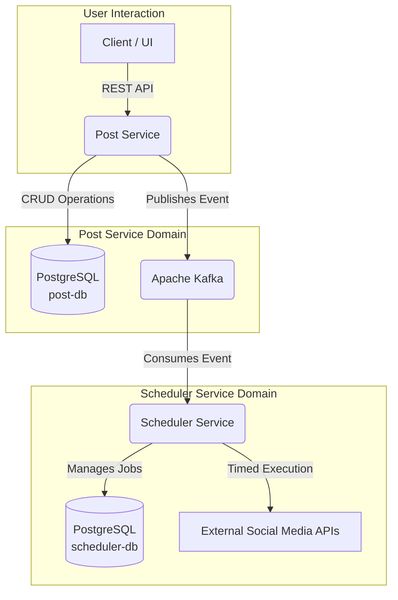

# 🚀 Social Media Post Scheduler

This project is a backend system for scheduling social media posts, built with a microservices architecture. It consists of two main services: a `post-service` for managing post content and a `scheduler-service` for handling the publication timing and execution. The services communicate asynchronously using Apache Kafka.

---
## 🏛️ Architecture

The system is designed with a decoupled, event-driven approach. The `post-service` acts as the primary API for creating and managing content, while the `scheduler-service` works as a background processor that handles the publishing logic.



### Key Workflows:
* **Scheduled Post**: A client sends a `POST` request with a future `scheduledAt` time to the `post-service`. The service saves the post and publishes a `VariantReadyForSchedulingEvent` to Kafka. The `scheduler-service` consumes this event, saves a `ScheduledJob`, and executes it at the specified time.
* **Instant Post**: A client sends a `POST` request without a `scheduledAt` time. The `post-service` saves the post and publishes an event to a different Kafka topic for immediate publication.

---
## ✨ Features

### Post Service (`:8080`)
* CRUD operations for Posts, Post Variants, and Media Assets.
* Handles content creation and management.
* Publishes events to Kafka when a post variant is ready for scheduling or immediate publication.
* API documentation via Swagger UI.

### Scheduler Service (`:8081`)
* Consumes events from Kafka to create scheduled jobs.
* Handles both future-scheduled and immediate posts through different Kafka topics.
* Periodically checks for due jobs and executes them.
* Logs all publication attempts and their outcomes.
* Provides a management API to view the status of scheduled jobs.
* API documentation via Swagger UI.

---
## ⚙️ Technology Stack
* **Framework**: Spring Boot 3
* **Language**: Java 21
* **Build Tool**: Maven
* **Database**: PostgreSQL
* **Messaging**: Apache Kafka
* **Containerization**: Docker & Docker Compose
* **Mapping**: MapStruct
* **Utilities**: Lombok

---
## 🔧 Getting Started

### Prerequisites
Make sure you have the following installed on your machine:
* Java 21 (or newer)
* Apache Maven
* Docker
* Docker Compose

### Installation & Setup
1.  **Clone the repository:**
    ```bash
    git clone <your-repository-url>
    cd <your-repository-directory>
    ```

2.  **Build the services:**
    You need to build the JAR files for both microservices.
    ```bash
    # Build the post-service
    cd post-service
    mvn clean package -DskipTests

    # Build the scheduler-service
    cd ../scheduler-service
    mvn clean package -DskipTests
    ```

3.  **Run the entire stack:**
    From the root directory (where your `docker-compose.yml` is located), run the following command:
    ```bash
    docker-compose up --build -d
    ```
    This command will:
    * Build the Docker images for both services.
    * Start all containers (Zookeeper, Kafka, 2 PostgreSQL DBs, and your 2 services) in the background.

---
## 📚 API Reference

Once the application is running, you can access the interactive Swagger UI documentation for each service:

* **Post Service API**: `http://localhost:8080/swagger-ui.html`
* **Scheduler Service API**: `http://localhost:8081/swagger-ui.html`

### Key Endpoints

#### Post Service (`:8080`)
| Method | Endpoint | Description |
| :--- | :--- | :--- |
| `POST` | `/api/v1/posts` | Create a new master post. |
| `GET` | `/api/v1/posts` | Get all posts (paginated). |
| `GET` | `/api/v1/posts/{postId}` | Get a specific post by its ID. |
| `POST` | `/api/v1/posts/{postId}/variants` | Create a variant for a post. |
| `GET` | `/api/v1/posts/{postId}/variants` | Get all variants for a post. |

#### Scheduler Service (`:8081`)
| Method | Endpoint | Description |
| :--- | :--- | :--- |
| `GET` | `/api/v1/jobs` | Get all jobs (paginated). |
| `GET` | `/api/v1/jobs/{jobId}` | Get a specific job by its ID. |
| `DELETE` | `/api/v1/jobs/{jobId}` | Cancel (soft-delete) a pending job. |
| `POST` | `/api/v1/jobs/{jobId}/repost` | "Un-cancel" a soft-deleted job. |
| `GET` | `/api/v1/jobs/{jobId}/attempts` | Get the publish history for a job. |

---
## 📨 Asynchronous API (Kafka Topics)
The services communicate via the following topics:

| Topic Name | Event Payload | Description |
| :--- | :--- | :--- |
| `variant-scheduling-topic` | `VariantReadyForSchedulingEvent` | For post variants with a future `scheduledAt` time. |
| `variant-immediate-publish-topic`| `VariantReadyForSchedulingEvent` | For post variants with no `scheduledAt` time (publish now). |

---
## 📄 Configuration
The primary configuration for the containerized environment is managed through environment variables in the `docker-compose.yml` file. These override the default values located in the `application.properties` file of each service.

The default properties are configured for local development, allowing each service to be run standalone if the required infrastructure (Postgres, Kafka) is running on `localhost`.
